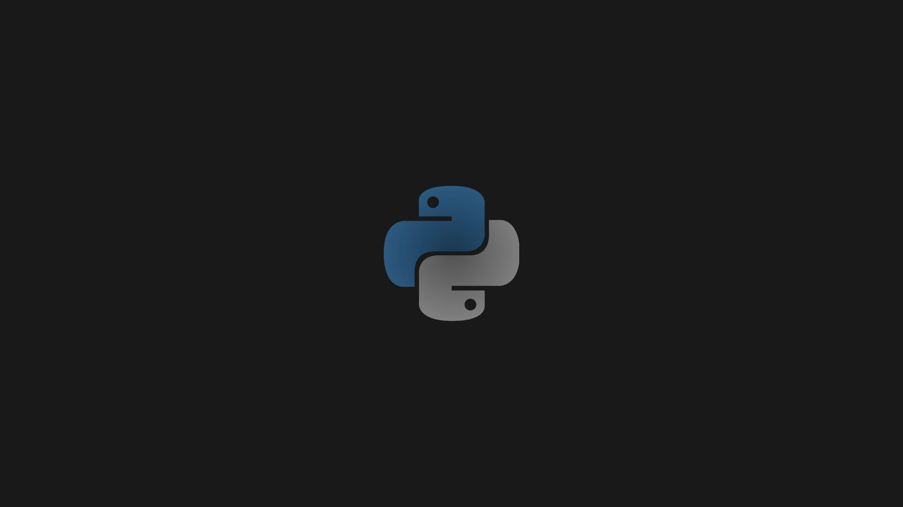

<!-- Projeto Finalizado -->
# 💬 Hashtag: Chat em Tempo Real

  <!-- Contador de linguagens do GitHub -->
  
  <!-- Tamanho do repositório no GitHub -->
  
  <!-- Licença do GitHub -->
  

  

## 🎯 Objetivo do Projeto
- **Desenvolver um chat interativo** com Flet, onde os usuários podem se comunicar instantaneamente.
- **Utilizar Pub/Sub** para gerenciar a comunicação entre os usuários.
- **Renderizar mensagens em tempo real** no chat.

## 🛠 Tecnologias Empregadas
- **Flet**: Biblioteca utilizada para a criação da interface do chat e gerenciamento do estado da aplicação.

## 🧭 Guia de Implementação
1. **Certifique-se que Flet Está Instalado**
   - Execute `pip install flet` para instalar a biblioteca Flet, se necessário.
2. **Inicialize o Projeto**
   - No terminal, execute `python nome_do_arquivo.py` para iniciar o projeto.
3. **Inscreva-se para Receber Mensagens**
   - A função `enviar_mensagem_tunel` processa e adiciona mensagens ao chat quando publicadas.
4. **Envie Mensagens**
   - A função `enviar_mensagem` envia uma mensagem para todos os usuários quando o botão é clicado ou o campo de texto é submetido.

## 💪 Contribuição
Contribuições são bem-vindas! Para contribuir, siga estas etapas:
1. Faça um fork do projeto.
2. Crie uma nova branch para sua feature `git checkout -b feature/nome-feature`.
3. Commit suas mudanças `git commit -m 'Adiciona nova feature'`.
4. Envie para a branch `git push origin feature/nome-feature`.
5. Abra um Pull Request.

## 📝 Nota
Este projeto foi baseado em uma aula da **Hashtag**. Sinta-se livre para explorar e adaptar.
